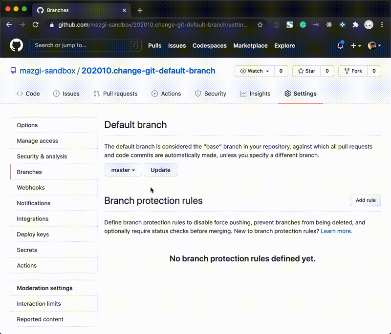

# 202010.change-git-default-branch

```shellsession
❯ git branch -vv        
* master 6d42ee1 [origin/master] Initial commit
```

```shellsession
❯ git branch --move master main
T/tmp.YWcLRrR4/202010.change-git-default-branch on  main 
❯ git branch -vv               
* main 6d42ee1 [origin/master] Initial commit
```

```shellsession
❯ git push origin main  
Total 0 (delta 0), reused 0 (delta 0)
remote: 
remote: Create a pull request for 'main' on GitHub by visiting:
remote:      https://github.com/mazgi-sandbox/202010.change-git-default-branch/pull/new/main
remote: 
To github.com:mazgi-sandbox/202010.change-git-default-branch.git
 * [new branch]      main -> main
❯ git branch --all --list
* main
  remotes/origin/HEAD -> origin/master
  remotes/origin/main
  remotes/origin/master
```



```shellsession
❯ git fetch origin --prune     
From github.com:mazgi-sandbox/202010.change-git-default-branch
 - [deleted]         (none)     -> origin/master
   (refs/remotes/origin/HEAD has become dangling)
❯ git branch --all --list
warning: ignoring broken ref refs/remotes/origin/HEAD
* main
  remotes/origin/main
```

```shellsession
❯ git remote set-head origin --auto                                                                
origin/HEAD set to main
❯ git branch --all --list | cat    
* main
  remotes/origin/HEAD -> origin/main
  remotes/origin/main
```
